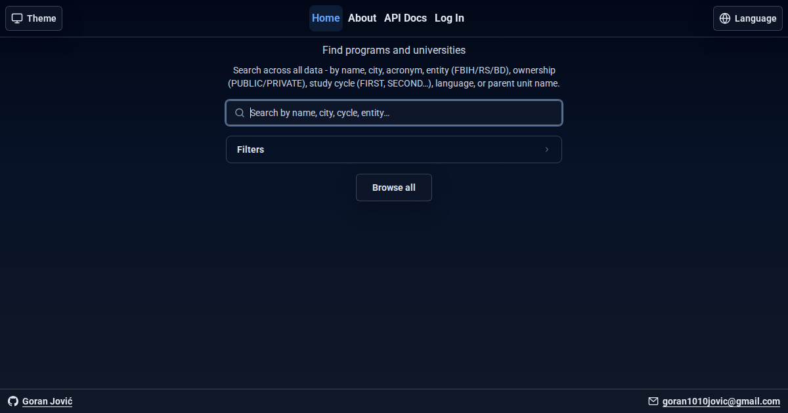
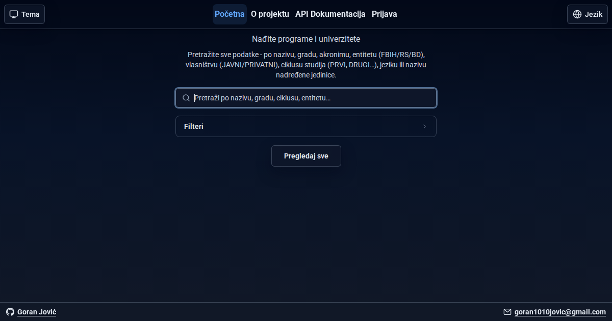

# Atlas Univerziteta

**English** | [Bosanski / Hrvatski / Srpski](#bosanski--hrvatski--srpski)

An open-source directory of higher-education data for Bosnia and Herzegovina: a public REST API, a searchable webapp, and an authenticated contribution workflow with admin moderation.

- Live webapp: <https://atlasuniverziteta.com/>
- Live REST API: <https://api.atlasuniverziteta.com/>
- In-app API docs: <https://atlasuniverziteta.com/api-docs>



The data is modeled as a nested academic hierarchy: university, its faculties, and their study programs - each program carrying its tracks (smjerovi) as part of its data.

## Features

- Public REST API under `/api/v1` - no authentication required
- Unified search across universities, faculties, and study programs: multi-word queries where every word must match somewhere in the entity's hierarchy, case- and diacritic-insensitive, tolerant of Bosnian/Croatian/Serbian inflected forms, with ECTS/duration/founding-year matching and local-language filter words (e.g. "javna" finds public universities)
- Relevance-ranked, grouped results with per-type filters, counts, and capped sections
- Detail pages for universities and faculties with shareable links and per-page social previews
- Email/password signup with confirmation emails, session login, and optional GitHub OAuth (with account linking either way)
- Authenticated suggestions for creating, updating, or deleting data, reviewed by admins before applying
- CSRF protection, Zod validation on both ends, WCAG-checked UI in English and the local language

## Quick start

```bash
git clone https://github.com/goran1010/atlas-univerziteta.git
cd atlas-univerziteta
npm run install:all
cp server/.env.example server/.env && cp webapp/.env.example webapp/.env
npm run db:deploy_generate && npm run db:seed
npm run dev:all
```

Requires Node.js 24.x and PostgreSQL. Full instructions, environment variables, and testing: [docs/SETUP.md](./docs/SETUP.md). Hosting layout and share-preview builds: [docs/DEPLOYMENT.md](./docs/DEPLOYMENT.md).

## API in brief

Base URL: `https://api.atlasuniverziteta.com`

```text
GET /                     service index
GET /api/v1/universities        also /universities/:id
GET /api/v1/faculties           also /faculties/:id
GET /api/v1/study-programs      also /study-programs/:id
GET /api/v1/tracks              also /tracks/:id
GET /api/v1/search?searchTerm=&entity=&ownership=&cycle=&type=
```

Responses return `{ "message", "data" }`; errors return `{ "error": { "code", "message" } }`. Interactive documentation with examples lives at [atlasuniverziteta.com/api-docs](https://atlasuniverziteta.com/api-docs).

## Testing

```bash
npm run test:all   # server + webapp unit/integration + Playwright e2e with axe accessibility scans
```

Details in [docs/SETUP.md](./docs/SETUP.md#testing).

## Contributing

See [CONTRIBUTING.md](./docs/CONTRIBUTING.md) - code, documentation, bug reports, and data-quality improvements are all welcome. Data suggestions can also be submitted in-app under "Improve data".

## License

GNU Affero General Public License v3.0 - see [LICENSE.md](./LICENSE.md).

University data sourced from [Agencija za razvoj visokog obrazovanja i osiguranje kvaliteta BiH (HEA)](https://www.hea.gov.ba/Content/Read/lista-akreditiranih-vsu).

Author: Goran Jović - [@goran1010](https://github.com/goran1010) · [contributors](https://github.com/goran1010/atlas-univerziteta/contributors)

---

## Bosanski / Hrvatski / Srpski

[English](#atlas-univerziteta) | **Bosanski / Hrvatski / Srpski**

Atlas Univerziteta je projekat otvorenog koda sa podacima o visokom obrazovanju u Bosni i Hercegovini: javni REST API, web aplikacija sa pretragom i sistem prijedloga izmjena uz administratorsku provjeru.

- Web aplikacija: <https://atlasuniverziteta.com/>
- REST API: <https://api.atlasuniverziteta.com/>
- API dokumentacija: <https://atlasuniverziteta.com/api-docs>



Podaci prate akademsku hijerarhiju: univerzitet, njegovi fakulteti i njihovi studijski programi - svaki program nosi svoje smjerove kao dio svojih podataka.

### Mogućnosti

- Javni REST API pod `/api/v1` - bez prijave i bez ključeva
- Objedinjena pretraga univerziteta, fakulteta i studijskih programa: više riječi odjednom (svaka riječ se traži kroz cijelu hijerarhiju), neosjetljiva na velika/mala slova i dijakritike, prepoznaje padeže i rodove (medicina/medicine/medicini, javna/javni/javno), kao i ECTS bodove, trajanje i godinu osnivanja
- Rezultati rangirani po relevantnosti i grupisani po tipu, uz filtere, brojače i ograničene sekcije sa "Prikaži sve"
- Stranice sa detaljima univerziteta i fakulteta, sa linkovima za dijeljenje i ispravnim pregledima na društvenim mrežama
- Registracija uz potvrdu emailom, prijava sesijom i opciona GitHub prijava (sa povezivanjem naloga u oba smjera)
- Prijavljeni korisnici predlažu dodavanje, izmjenu ili brisanje podataka; administratori pregledaju prijedloge prije primjene
- CSRF zaštita, validacija podataka na obje strane, pristupačnost provjerena po WCAG standardu, interfejs na engleskom i našem jeziku

### Pokretanje

Komande su iste kao u [engleskom dijelu](#quick-start) - potrebni su Node.js 24.x i PostgreSQL. Detaljna uputstva se nalaze u [docs/SETUP.md](./docs/SETUP.md) (na engleskom).

### Doprinos projektu

Pogledajte [CONTRIBUTING.md](./docs/CONTRIBUTING.md). Prijedloge podataka možete slati i direktno kroz aplikaciju, pod "Poboljšaj podatke". Podaci o univerzitetima preuzeti su od [Agencije za razvoj visokog obrazovanja i osiguranje kvaliteta BiH (HEA)](https://www.hea.gov.ba/Content/Read/lista-akreditiranih-vsu).

Licenca: GNU Affero General Public License v3.0 - [LICENSE.md](./LICENSE.md).
